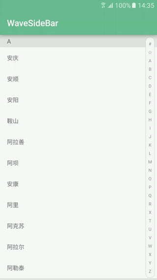
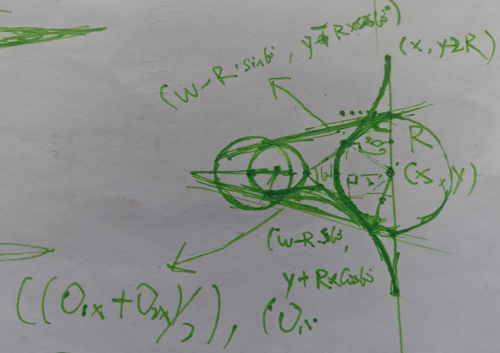

WaveSideBar project
===================

一个快速跳跃分组的侧边栏控件，示例中配合RecyclerView实现。



波浪的实现采用了三段二次贝塞尔曲线，附一张手稿草图，仅供参考。



Usage
---
#### **use `WaveSideBarView` in the layout file**

```xml
    <cc.solart.wave.WaveSideBarView
        android:id="@+id/side_view"
        android:layout_width="match_parent"
        android:layout_height="match_parent"/>
```

#### **set `OnTouchLetterChangeListener`**

```java
    mSideBarView.setOnTouchLetterChangeListener(new WaveSideBarView.OnTouchLetterChangeListener() {
            @Override
            public void onLetterChange(String letter) {
                int pos = adapter.getLetterPosition(letter);

                if (pos != -1) {
                    mRecyclerView.scrollToPosition(pos);
                }
            }
        });
```

    
Thanks
------
used PinnedHeaderDecoration in
[RecyclerItemDecoration](https://github.com/dinuscxj/RecyclerItemDecoration)
    
License
---

    No fucking license. just enjoy it!